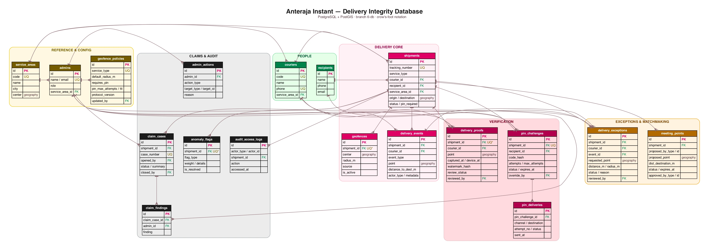

# Anteraja Instant — Database (branch `6-db`)

Basis data relasional untuk modul **Anteraja Instant Delivery Integrity**. Skema
diturunkan dari `docs/PRD-anteraja-instant.md`, lima FRD di `docs/frd/`, dan
rancangan UI di `docs/ui/`, lalu dinormalisasi menjadi tabel yang mendukung seluruh
fitur verifikasi pengiriman *last-mile*.

| | |
|---|---|
| **Produk** | Anteraja — Satria Rapid Field Dispatch |
| **DBMS** | PostgreSQL 14+ dengan **PostGIS** (dan `pgcrypto` untuk hash) |
| **Branch** | `6-db` |
| **Referensi** | `docs/PRD-anteraja-instant.md`, `docs/frd/FRD-01..05`, `docs/ui/` |
| **ERD** | [`erd.webp`](./erd.webp) (sumber: [`erd.dot`](./erd.dot)) |

---

## 1. Berkas

| Berkas | Isi |
|---|---|
| [`schema.sql`](./schema.sql) | DDL lengkap: 18 tabel, constraint, index (termasuk GiST), view, function, trigger |
| [`seed.sql`](./seed.sql) | Data dummy (dari `docs/data/shipments-couriers-coordinates.csv`) yang mencakup seluruh skenario FRD |
| [`queries.sql`](./queries.sql) | Query verifikasi per FRD + pemeriksaan integritas/normalisasi |
| [`erd.dot`](./erd.dot) | Sumber diagram ERD (Graphviz) |
| [`erd.webp`](./erd.webp) | Diagram ERD (crow's foot) |
| [`db-documentation.typ`](./db-documentation.typ) / `.pdf` | Dokumen pengumpulan (LMS) |

## 2. Cara Menjalankan

### Supabase (sesuai PRD)
Buka SQL Editor lalu jalankan `schema.sql` kemudian `seed.sql`. PostGIS sudah
tersedia di Supabase; `pgcrypto` juga aktif secara default.

### PostgreSQL lokal
```sh
createdb anteraja
psql -d anteraja -f schema.sql
psql -d anteraja -f seed.sql
psql -d anteraja -f queries.sql
```

### Docker (PostGIS)
```sh
docker run -d --name anteraja-pg \
  -e POSTGRES_PASSWORD=postgres -e POSTGRES_DB=anteraja \
  -v "$PWD/docs/db":/db -p 55432:5432 postgis/postgis:16-3.4

docker exec anteraja-pg psql -U postgres -d anteraja -f /db/schema.sql
docker exec anteraja-pg psql -U postgres -d anteraja -f /db/seed.sql
```

`schema.sql` dirancang untuk database kosong. `seed.sql` dapat dijalankan ulang
(idempotent) karena membuka dengan `TRUNCATE`.

## 3. Konvensi Penamaan

- **Tabel** `snake_case`, bentuk **jamak** (`shipments`, `delivery_events`).
- **Kolom** `snake_case` deskriptif; kunci asing memakai pola `<entitas>_id`
  (`courier_id`, `service_area_id`).
- **Kunci utama** `id uuid` dengan `gen_random_uuid()`.
- **Kolom audit** `created_at` / `updated_at` (`timestamptz`); `updated_at`
  dipelihara oleh trigger `fn_touch_updated_at`.
- **Status/tipe** dibatasi `CHECK` (portabel di semua host Postgres, tanpa enum type).
- **Koordinat** `geography(Point,4326)` (WGS84) — satu kolom, bukan dua float.
- **Jarak** `integer` dalam **meter**; waktu disimpan `timestamptz` (UTC).

## 4. Kamus Tabel

### 4.1 Reference & Configuration

#### `service_areas`
Wilayah operasional / hub; dirujuk kurir, admin, dan pengiriman (filter "wilayah"
pada dashboard).
| Kolom | Tipe | Keterangan |
|---|---|---|
| `id` | uuid **PK** | |
| `code` | text **UQ** | Kode ringkas, mis. `JKS` |
| `name`, `city` | text | Nama wilayah & kota |
| `center` | geography(Point) | Titik pusat wilayah |
| `is_active` | boolean | Status aktif |

#### `admins`
Aktor Admin/CS (`getCurrentAdmin`). Sumber identitas setiap keputusan admin.
| Kolom | Tipe | Keterangan |
|---|---|---|
| `id` | uuid **PK** | |
| `name` | text | |
| `email` | text **UQ** | |
| `role` | text | `superadmin` / `ops_admin` / `cs_agent` |
| `service_area_id` | uuid **FK** → `service_areas` | Wilayah bertugas |

#### `geofence_policies`
Kebijakan radius & PIN **per segmen layanan** (FR-01-02, FR-03).
| Kolom | Tipe | Keterangan |
|---|---|---|
| `id` | uuid **PK** | |
| `service_type` | text **UQ** | `instant` / `same_day` / `regular` |
| `default_radius_m` | integer | `instant` 30, `same_day` 50, `regular` 100 |
| `requires_pin` | boolean | Kewajiban PIN (true untuk instant & same_day) |
| `pin_max_attempts` / `pin_ttl_minutes` / `pin_max_resends` | integer | Batas PIN (FR-03-04/06) |
| `protocol_version` | text | Mis. `Fleet Safety Protocol v4.2` (layar Pengaturan Radius) |
| `updated_by` | uuid **FK** → `admins` | Admin terakhir yang mengubah |

### 4.2 People

#### `couriers`
Kurir SATRIA (`getCurrentCourier`): `id, code, name, phone, service_area_id, is_active`.
`code` & `phone` unik. **FK** `service_area_id` → `service_areas`.

#### `recipients`
Penerima/pembeli: `id, name, phone, email`. Menjadi tujuan pengiriman PIN (FR-03)
dan pihak pada matchmaking lokasi (FRD-04).

### 4.3 Delivery Core

#### `shipments`
Inti pengiriman.
| Kolom | Tipe | Keterangan |
|---|---|---|
| `id` | uuid **PK** | |
| `tracking_number` | text **UQ** | Nomor resi/AWB |
| `service_type` | text | `instant` / `same_day` / `regular` |
| `courier_id` | uuid **FK** → `couriers` | Nullable sebelum pickup |
| `recipient_id` | uuid **FK** → `recipients` | |
| `service_area_id` | uuid **FK** → `service_areas` | |
| `origin`, `destination` | geography(Point) | Titik asal & tujuan (tujuan = pusat geofence) |
| `destination_address` | text | |
| `status` | text | `pending` / `picked_up` / `in_transit` / `delivered` / `failed` |
| `pin_required` | boolean | Ditentukan dari `service_type` |
| `cod_amount` | integer | Nilai COD (0 bila tanpa COD) |
| `delivered_at` | timestamptz | |

#### `geofences`
Pusat & radius geofence per pengiriman (FRD-01). Dua partial unique index menjaga:
**satu geofence aktif** per pengiriman, dan satu geofence valid per sumber.
`source` = `destination` atau `meeting_point` (FR-04-07). Index **GiST** pada `center`.

#### `delivery_events`
Log peristiwa tak-termutasi (PRD + FRD-04/05). `event_type` mencakup `pickup`,
`arrived`, `delivery_attempt`, `delivered`, `failed`, `pin_verification`,
`geofence_check`, `exception_requested/decided`, `meeting_point_proposed/approved`,
`pod_captured`. Menyimpan `point` (geography), `distance_to_destination_m`,
`actor_type` (`courier`/`recipient`/`admin`/`system`), dan `metadata` jsonb.
Index komposit `(shipment_id, created_at)` mempercepat audit trail kronologis.

### 4.4 Verification

#### `delivery_proofs`
Foto POD ber-geotag & ber-watermark (FRD-02). Menyimpan `point`,
`distance_to_destination_m`, `captured_at` (jam server), `device_captured_at`
(indikator anomali), `watermark_hash`, `recipient_name`, serta `review_status`
(`valid`/`needs_review`/`invalid`) + jejak tinjauan admin. Partial unique index
memastikan **hanya satu POD berstatus `valid`** per pengiriman.

#### `pin_challenges`
Satu challenge PIN per pengiriman (FRD-03). PIN disimpan sebagai `code_hash`
(tidak pernah mentah). Memuat `attempts`/`max_attempts`, `resend_count`, `status`
(`pending`/`verified`/`locked`/`expired`/`override`), `expires_at`, serta jejak
override admin (`override_by`, `override_reason`, `override_at`).

#### `pin_deliveries`
Riwayat pengiriman PIN (kanal `email`/`sms`/`whatsapp`, tujuan, `attempt_no`,
`status`, `provider_message_id`, `sent_at`). Menopang batas kirim ulang FR-03-04.

### 4.5 Exceptions & Matchmaking

#### `delivery_exceptions`
Pengajuan penyelesaian **di luar radius** (FRD-01). Menyimpan `requested_point`,
`distance_m`, `radius_m`, `reason`, `status` (`pending`/`approved`/`rejected`/
`cancelled`), dan keputusan admin (`reviewed_by`, `reviewed_at`, `review_note`).
FK `event_id` menautkan ke `delivery_events` percobaan yang gagal. Partial unique
index menjaga satu pengajuan `pending` per pengiriman.

#### `meeting_points`
Usulan & persetujuan titik temu kurir ↔ pembeli (FRD-04). Menyimpan pengusul
(`proposed_by_type`/`proposed_by_id`), `proposed_point`, jarak ke tujuan & pembeli,
`status`, dan penyetuju. Partial unique index menjaga **satu titik temu final**
(`approved`/`admin_set`) dan satu usulan `proposed` per pengiriman.

### 4.6 Claims & Audit

#### `claim_cases`
Kasus klaim per pengiriman (FRD-05): `case_number` **UQ**, `opened_by`,
`status` (`open`/`investigating`/`closed`), `summary`, `resolution`, `closed_by`,
`closed_at`.

#### `claim_findings`
Temuan investigasi (banyak per kasus): `claim_case_id` **FK**, `admin_id` **FK**, `finding`.

#### `anomaly_flags`
Penanda anomali + bobot per pengiriman (FR-05-05): `flag_type`
(`out_of_radius`, `device_time_mismatch`, `repeated_pin_failure`, `pod_needs_review`,
`exception_used`), `weight`, `details`, `is_resolved`. Unique `(shipment_id, flag_type)`.

#### `audit_access_logs`
Log akses audit trail (FR-05-09): `actor_type`/`actor_id`, `shipment_id`, `action`
(`view`/`export`/`close_case`), `context`, `accessed_at`.

#### `admin_actions`
Audit keputusan admin lintas fitur dengan target generik
(`action_type` + `target_type`/`target_id`) dan `reason`.

## 5. Relasi Antar Tabel

- `service_areas` 1—* `couriers`, `admins`, `shipments`
- `geofence_policies` 1—* (kebijakan per `service_type`, diubah `admins`)
- `couriers` 1—* `shipments`, `delivery_events`, `delivery_proofs`, `delivery_exceptions`
- `recipients` 1—* `shipments`, `pin_challenges`
- `shipments` 1—* `geofences`, `delivery_events`, `delivery_proofs`,
  `delivery_exceptions`, `meeting_points`, `claim_cases`, `anomaly_flags`,
  `audit_access_logs`
- `shipments` 1—**1** `pin_challenges`
- `pin_challenges` 1—* `pin_deliveries`
- `claim_cases` 1—* `claim_findings`
- `admins` 1—* `geofence_policies`, `delivery_proofs`, `pin_challenges`,
  `delivery_exceptions`, `claim_cases`, `claim_findings`, `admin_actions`

## 6. Normalisasi

Skema berada pada **3NF**:

- **1NF** — setiap kolom atomik; tidak ada grup berulang. Kanal PIN, temuan klaim,
  dan event pengiriman dipisahkan ke tabel sendiri (bukan kolom berulang).
- **2NF** — semua tabel ber-PK tunggal (`id uuid`) dan setiap atribut bergantung
  penuh pada PK; tidak ada ketergantungan parsial.
- **3NF** — tidak ada ketergantungan transitif: kebijakan radius/PIN dikeluarkan ke
  `geofence_policies` (bukan diduplikasi di `shipments`/`geofences`), wilayah ke
  `service_areas`, identitas admin/evaluator ke `admins`.
- **Integritas** dijaga di lapisan DB: `CHECK` untuk status/tipe, FK dengan aksi
  `ON DELETE` eksplisit, serta **partial unique index** untuk aturan bisnis
  ("satu geofence aktif", "satu POD valid", "satu titik temu final", "satu
  pengajuan pending").
- **Jejak audit** tidak dihapus saat kasus ditutup — konsisten dengan aturan
  read-only audit trail (FR-05).

## 7. Pemetaan ke FRD

| FRD | Tabel utama | Objek pendukung |
|---|---|---|
| FRD-01 Geofencing Lock | `geofences`, `delivery_events`, `shipments` | `delivery_exceptions`, `geofence_policies`, `fn_evaluate_geofence()` |
| FRD-02 POD Geotag | `delivery_proofs` | `anomaly_flags` (pod_needs_review) |
| FRD-03 PIN per Segmen | `pin_challenges` | `pin_deliveries`, `geofence_policies`, `admin_actions` |
| FRD-04 Location Matchmaking | `meeting_points` | `delivery_events`, `geofences` (source `meeting_point`) |
| FRD-05 Claim Audit Trail | `v_shipment_audit_trail`, `claim_cases`, `anomaly_flags` | `claim_findings`, `audit_access_logs`, `v_shipment_anomaly_score` |

## 8. View & Function

| Objek | Kegunaan |
|---|---|
| `fn_distance_to_destination(shipment, lat, lng)` | Jarak meter ke titik tujuan (`ST_Distance`) |
| `fn_evaluate_geofence(shipment, lat, lng)` | Keputusan server: `distance_m`, `radius_m`, `inside` |
| `v_shipment_audit_trail` | Satu baris ringkas per pengiriman (event, POD, PIN, pengecualian, titik temu, klaim) |
| `v_shipment_anomaly_score` | Skor anomali per pengiriman; `>= 2.00` → **perlu tinjauan** |

## 9. Data Contoh

`seed.sql` memuat 15 pengiriman (selaras `docs/data/*.csv`) dengan skenario:

- Pengiriman normal di dalam radius (instant/same_day/regular).
- Geofence gagal (`AJ2509000005`, `AJ2509000006`, `AJ2509000012`).
- PIN: `verified`, `locked` (3× salah), `expired`, `pending`, dan override admin.
- POD `needs_review`: di luar geofence (`…0006`) dan selisih waktu perangkat (`…0010`).
- Pengecualian: satu `pending` (`…0005`), dua `approved` (`…0006`, `…0014`).
- Titik temu: satu final `approved` (`…0006`), satu `proposed` (`…0005`).
- Klaim: satu `investigating`, satu `closed` beserta temuan.
- Anomali: 4 pengiriman **perlu tinjauan** (`…0005`, `…0006`, `…0007`, `…0010`) —
  cocok dengan angka `4 perlu tinjauan` pada dashboard UI.

## 10. Verifikasi

`queries.sql` menjalankan, antara lain:

- evaluasi geofence di dalam & di luar radius (`fn_evaluate_geofence`);
- daftar keputusan geofence per pengiriman (`inside` true/false);
- status PIN & batas kirim ulang;
- titik temu dan geofence berpusat titik temu;
- audit trail lengkap & skor anomali;
- jumlah baris per tabel dan pemeriksaan invarian (satu geofence aktif / satu POD valid /
  satu titik temu final).

Skema telah diuji end-to-end pada PostgreSQL 16 + PostGIS 3.4 (Docker): `schema.sql`,
`seed.sql`, dan `queries.sql` berjalan tanpa error.

## 11. ERD



Notasi *crow's foot*: ujung **tee** = sisi "satu", ujung **crow** = sisi "banyak".
Legenda kolom: **PK** (primary key), **FK** (foreign key), **UQ** (unique).

```sh
# Regenerasi gambar ERD
cd docs/db
dot -Tpng -Gdpi=150 erd.dot -o /tmp/erd.png && cwebp -q 90 /tmp/erd.png -o erd.webp
```

```sh
# Regenerasi dokumen PDF
cd docs/db
typst compile --font-path ../ui/fonts db-documentation.typ db-documentation.pdf
```
