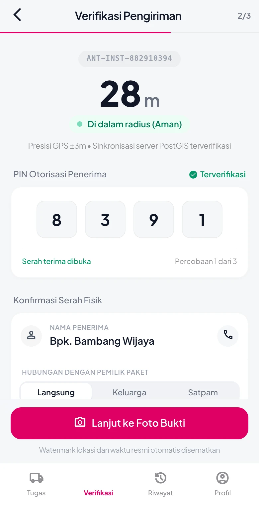
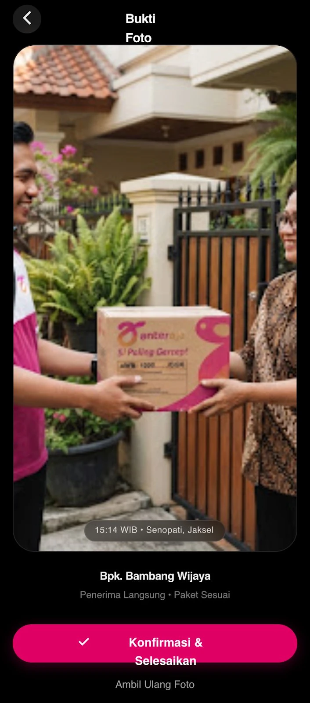
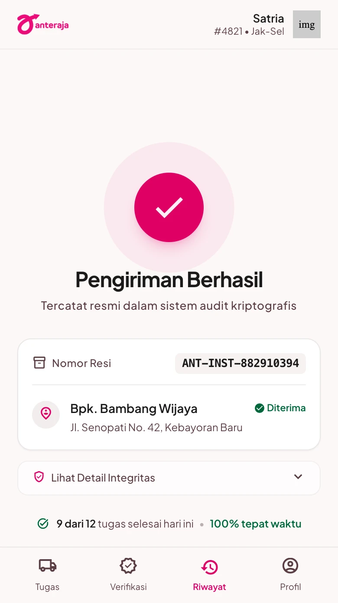
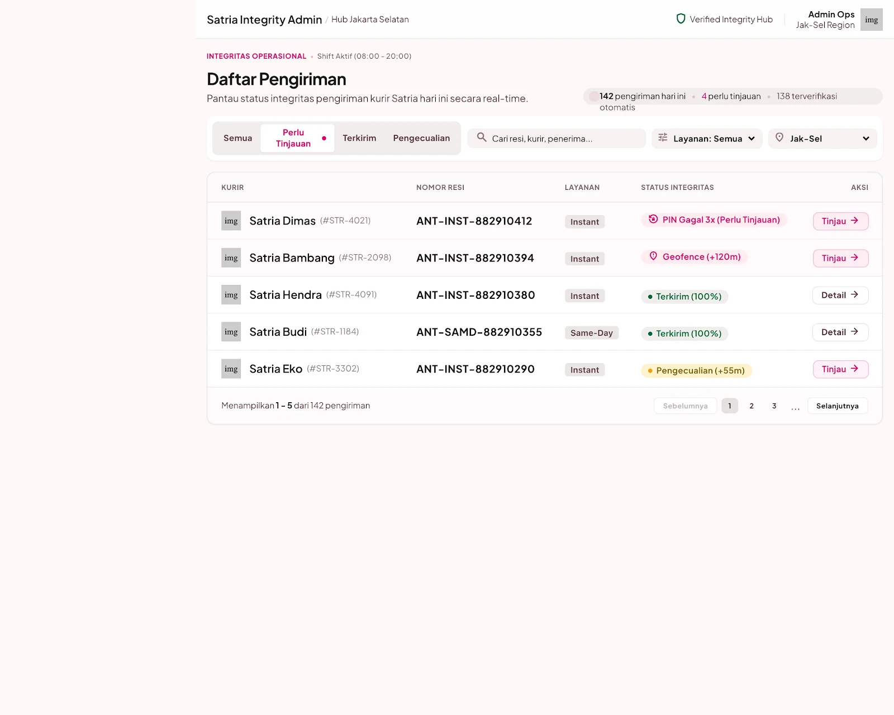
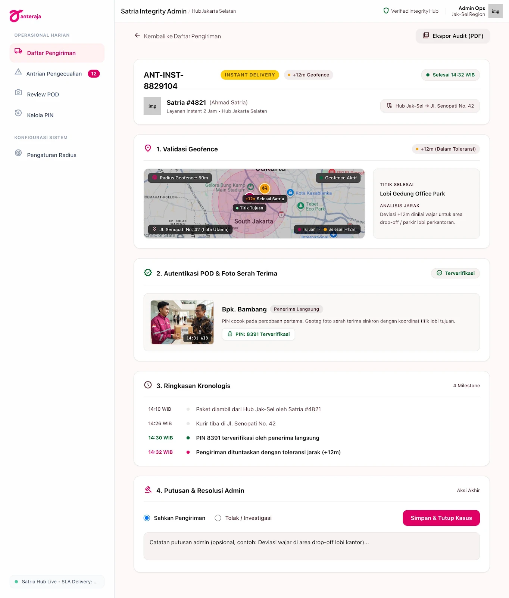
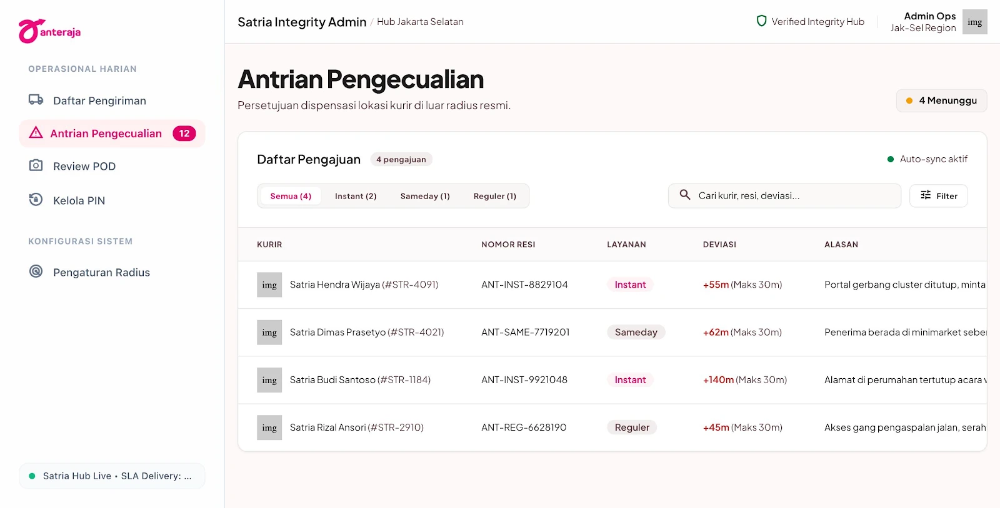
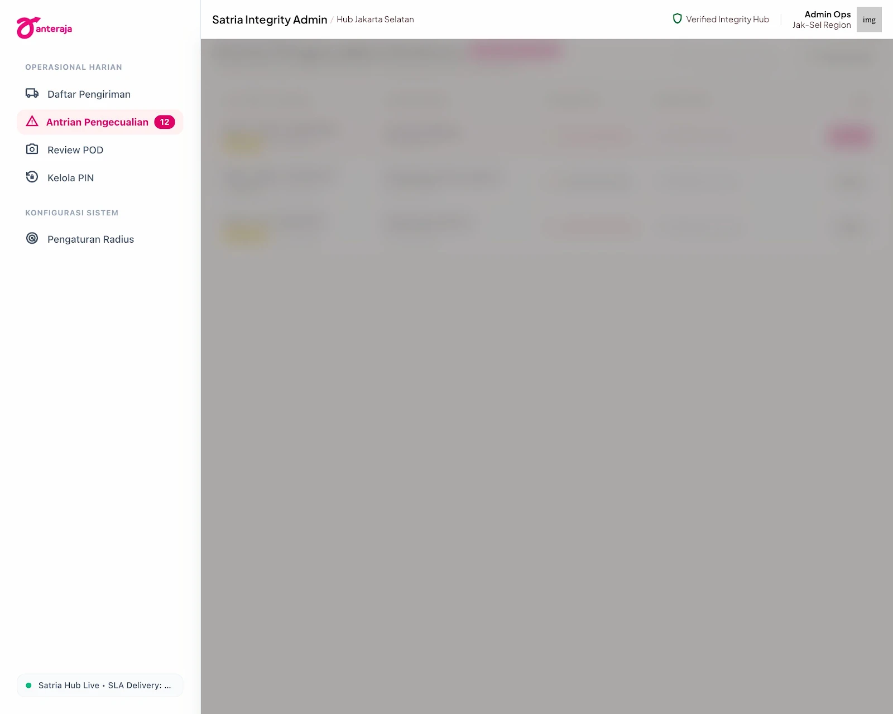
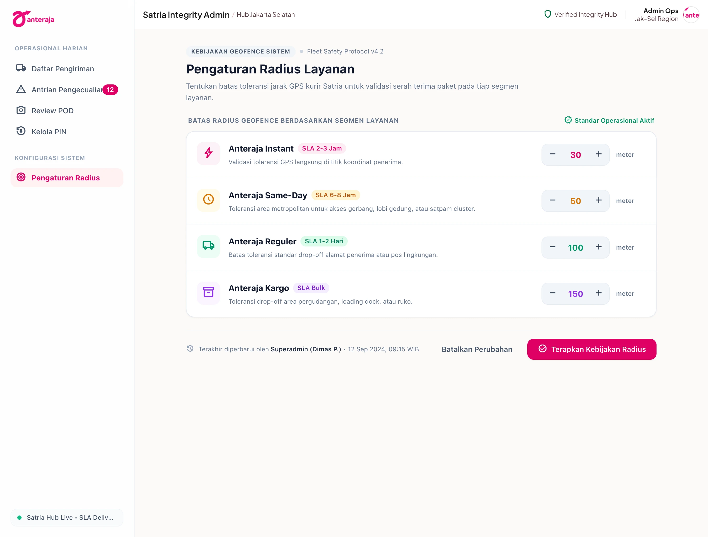

# Satria Rapid Field Dispatch — UI Design

Rancangan antarmuka **Anteraja** untuk alur pengiriman berbasis geolokasi. Desain
mengacu pada `docs/frd/` dan PRD (`docs/PRD-anteraja-instant.md`), lalu diwujudkan
sebagai satu design system dengan dua platform: aplikasi **mobile** untuk kurir
lapangan dan konsol **desktop** untuk Admin/Hub.

| | |
|---|---|
| **Produk** | Anteraja — Satria Rapid Field Dispatch |
| **Design system** | [`DESIGN.md`](./DESIGN.md) — warna, tipografi, spacing, komponen (dipakai kedua platform) |
| **Platform** | Mobile (kurir, 780px) dan Desktop (admin/hub, 1364–1600px) |
| **Alur kurir** | Tugas → Verifikasi Lokasi & PIN → Bukti Foto → Konfirmasi Sukses |
| **Alur admin** | Dashboard → Detail Audit Trail → Antrian Pengecualian → Pengaturan Radius |

Setiap layar disimpan sebagai screenshot `.webp`, sesuai ketentuan pengumpulan.
Penamaan berkas: `mobile-NN-*` untuk kurir, `desktop-NN-*` untuk Admin/Hub.

---

## Mobile — Aplikasi Kurir

Daftar layar:

| # | Layar | Berkas | Menjawab FRD |
|---|---|---|---|
| 1 | Daftar Tugas Pengiriman | [`mobile-01-daftar-tugas-pengiriman.webp`](./mobile-01-daftar-tugas-pengiriman.webp) | FRD-03, FRD-04 |
| 2 | Verifikasi Lokasi (PIN) | [`mobile-02-verifikasi-lokasi-pin.webp`](./mobile-02-verifikasi-lokasi-pin.webp) | FRD-01, FRD-03, FRD-04 |
| 3 | Ambil Bukti Foto | [`mobile-03-ambil-bukti-foto.webp`](./mobile-03-ambil-bukti-foto.webp) | FRD-02 |
| 4 | Konfirmasi Sukses | [`mobile-04-konfirmasi-sukses.webp`](./mobile-04-konfirmasi-sukses.webp) | FRD-01, FRD-02, FRD-03, FRD-05 |

### 1. Daftar Tugas Pengiriman


Daftar stop aktif untuk satu kurir (`Satria #4821 • Jak-Sel`), diurutkan berdasarkan
jarak. Kartu paket menampilkan tujuan, jarak & estimasi waktu, AWB bergaya
`barcode-tracking`, serta badge segmen (Instant / Same-Day) dan penanda COD atau
wajib PIN. Aksi bawah: tombol **Pindai Resi**, navigasi Tugas / Verifikasi / Riwayat / Profil.

**Kebutuhan FRD yang ditangani**
- FRD-03: badge **Perlu PIN** menandai paket Instant/Same-Day yang wajib verifikasi PIN.
- FRD-04: jarak kurir ↔ titik tujuan (`250 m • 4 mnt`) mendukung kesepakatan titik temu.

### 2. Verifikasi Lokasi (PIN)



Layar serah terima. Menampilkan status geofence (`28 m — Di dalam radius (Aman)`,
presisi GPS ±3 m, sinkronisasi PostGIS terverifikasi), input PIN otorisasi penerima,
serta konfirmasi serah fisik (nama penerima, hubungan, pilihan Satpam/Keluarga/Langsung).
Percobaan PIN dibatasi (`1 dari 3`).

**Kebutuhan FRD yang ditangani**
- FRD-01: indikator jarak + status radius mengunci/alirkan tombol selesai.
- FRD-03: input PIN otorisasi penerima sebelum pengiriman dapat ditutup.
- FRD-04: konteks titik temu kurir ↔ pembeli ditampilkan sebelum serah terima.

### 3. Ambil Bukti Foto



Viewfinder kamera in-app untuk Proof of Delivery. Watermark lokasi & waktu resmi
disematkan otomatis (`15:14 WIB • Senopati, Jaksel`), menampilkan nama penerima dan
kondisi paket. Aksi: **Konfirmasi & Selesaikan** atau **Ambil Ulang Foto**.

**Kebutuhan FRD yang ditangani**
- FRD-02: foto bukti dengan watermark koordinat, alamat, penerima, tanggal, timestamp.

### 4. Konfirmasi Sukses



Konfirmasi pengiriman tuntas dengan ringkasan integritas audit: radius geofence
yang valid, status verifikasi PIN, stempel waktu NTP, dan kode hash audit. Menutup
alur dan menawarkan lanjut ke tugas berikutnya.

**Kebutuhan FRD yang ditangani**
- FRD-01: bukti radius geofence valid (`28 m`, batas `100 m`).
- FRD-03: status PIN tervalidasi.
- FRD-05: kode hash audit (`AUD-SEC-9912-SHA256`), stempel waktu NTP untuk jejak investigasi klaim.

---

## Desktop — Konsol Admin / Hub

Daftar layar:

| # | Layar | Berkas | Menjawab FRD |
|---|---|---|---|
| 1 | Dashboard Pengiriman | [`desktop-01-dashboard-pengiriman.webp`](./desktop-01-dashboard-pengiriman.webp) | FRD-01, FRD-04 |
| 2 | Detail Audit Trail | [`desktop-02-detail-audit-trail.webp`](./desktop-02-detail-audit-trail.webp) | FRD-05 |
| 3 | Antrian Pengecualian | [`desktop-03-antrian-pengecualian.webp`](./desktop-03-antrian-pengecualian.webp) | FRD-01 |
| 3b | Modal Detail Pengecualian | [`desktop-03b-modal-detail-pengecualian.webp`](./desktop-03b-modal-detail-pengecualian.webp) | FRD-01, FRD-05 |
| 4 | Pengaturan Radius | [`desktop-04-pengaturan-radius.webp`](./desktop-04-pengaturan-radius.webp) | FRD-01 |

Navigasi kiri tetap: Operasional Harian (Daftar Pengiriman, Antrian Pengecualian,
Review POD, Kelola PIN) dan Konfigurasi Sistem (Pengaturan Radius), dengan status
`SLA Delivery: 99.2%` dan identitas **Hub Admin Ops Jak-Sel**.

### 1. Dashboard Pengiriman



Ringkasan operasional harian (`142 pengiriman hari ini • 4 perlu tinjauan •
138 terverifikasi otomatis`). Tabel pengiriman dengan filter status (Semua / Perlu
Tinjauan / Terkirim / Pengecualian), layanan, dan wilayah; kolom kurir, nomor resi,
layanan, status, dan integritas.

**Kebutuhan FRD yang ditangani**
- FRD-01: menandai pengiriman yang perlu tinjauan geofence.
- FRD-04: konteks wilayah/koordinat per pengiriman.

### 2. Detail Audit Trail



Satu halaman audit lengkap untuk satu resi (`ANT-INST-8829104`): ringkasan layanan &
rute, validasi geofence, visual peta titik tujuan vs posisi kurir (+12 m, radius 50 m),
riwayat event, POD, dan status PIN. Menyediakan **Ekspor Audit (PDF)**.

**Kebutuhan FRD yang ditangani**
- FRD-05: seluruh jejak audit (event, POD, PIN, geofence, titik temu) dalam satu tampilan.

### 3. Antrian Pengecualian



Antrian persetujuan dispensasi lokasi kurir di luar radius resmi (`4 menunggu`).
Tabel pengajuan menampilkan kurir, resi, layanan, deviasi (`+55m`, maks `30m`),
alasan, dan aksi tinjau. Tersedia filter layanan, pencarian, dan auto-sync.

**Kebutuhan FRD yang ditangani**
- FRD-01: jalur alternatif tercatat saat tombol terkunci karena di luar radius.

### 3b. Modal Detail Pengecualian



Modal tinjauan **Detail Pengecualian Geofence** untuk satu tiket (`Instant #ANT-99201`).
Menampilkan kurir (`Budi Pratama • SAT-8821`) dan waktu tiket, ringkasan deviasi
(`Selisih +64m`, toleransi hub `30m`, jarak aktual `94m`, status GPS `Valid`), alasan
kurir, serta thumbnail **Foto Bukti Lokasi (POD)** dengan koordinat. Aksi keputusan:
**Tolak** atau **Setujui Pengecualian**.

**Kebutuhan FRD yang ditangani**
- FRD-01: keputusan dispensasi geofence yang tercatat.
- FRD-05: detail tiket sebagai bagian jejak audit.

### 4. Pengaturan Radius



Kebijakan geofence sistem (`Fleet Safety Protocol v4.2`). Admin menetapkan batas
toleransi jarak GPS per segmen layanan (Instant, Same-Day, Reguler) dengan preset
standar operasional dan penyesuaian manual.

**Kebutuhan FRD yang ditangani**
- FRD-01: konfigurasi radius geofence yang mengunci tombol selesai.

---

## Catatan Implementasi

- Palet: magenta `#E00065`, kuning energetik `#FFCF0E`, hijau verifikasi `#00834B`.
- Tipografi: Plus Jakarta Sans.
- Screenshot dikonversi dari PNG ke `.webp` (kualitas 90) dengan `cwebp`.
- Resolusi: mobile `706–780 px` (viewport HP); desktop high-resolution
  `2560×2048`, `2560×3002`, `2696×2048`, dan modal `2824×1614`.

## Dokumentasi PDF

Dokumen pengumpulan dibuat dari sumber Typst lalu diekspor ke PDF:

```sh
cd docs/ui
typst compile --font-path fonts ui-documentation.typ ui-documentation.pdf
```

- [`ui-documentation.typ`](./ui-documentation.typ) — sumber dokumentasi (10 halaman A4).
- [`ui-documentation.pdf`](./ui-documentation.pdf) — hasil ekspor untuk pengumpulan.
- `fonts/` — Plus Jakarta Sans (OFL) agar tipografi sesuai design system saat build.
