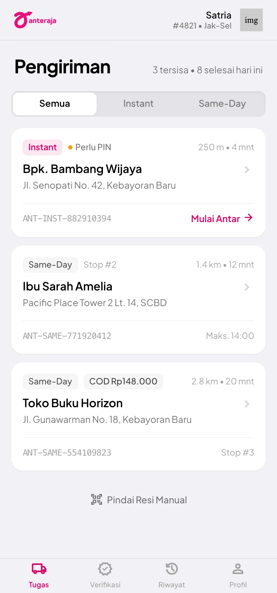

# Satria Rapid Field Dispatch — UI Design

Rancangan antarmuka aplikasi kurir **Anteraja** untuk alur pengiriman berbasis
geolokasi. Desain mengacu pada `docs/frd/` dan PRD (`docs/PRD-anteraja-instant.md`),
lalu diwujudkan sebagai design system + empat layar utama alur kurir.

| | |
|---|---|
| **Produk** | Aplikasi kurir Anteraja — Satria Rapid Field Dispatch |
| **Peran** | Kurir Lapangan (mobile-first, single-hand, glove touch) |
| **Design system** | [`DESIGN.md`](./DESIGN.md) — warna, tipografi, spacing, komponen |
| **Platform** | Mobile web / PWA, viewport 780px |
| **Alur** | Tugas → Verifikasi Lokasi & PIN → Bukti Foto → Konfirmasi Sukses |

## Daftar Layar

| # | Layar | Berkas | Menjawab FRD |
|---|---|---|---|
| 1 | Daftar Tugas Pengiriman | [`01-daftar-tugas-pengiriman.webp`](./01-daftar-tugas-pengiriman.webp) | FRD-03, FRD-04 |
| 2 | Verifikasi Lokasi (PIN) | [`02-verifikasi-lokasi-pin.webp`](./02-verifikasi-lokasi-pin.webp) | FRD-01, FRD-03, FRD-04 |
| 3 | Ambil Bukti Foto | [`03-ambil-bukti-foto.webp`](./03-ambil-bukti-foto.webp) | FRD-02 |
| 4 | Konfirmasi Sukses | [`04-konfirmasi-sukses.webp`](./04-konfirmasi-sukses.webp) | FRD-01, FRD-02, FRD-03, FRD-05 |

Setiap layar disimpan sebagai screenshot `.webp`, sesuai ketentuan pengumpulan.

## 1. Daftar Tugas Pengiriman

Daftar stop aktif untuk satu kurir (`Satria #4821 • Jak-Sel`), diurutkan berdasarkan
jarak. Kartu paket menampilkan tujuan, jarak & estimasi waktu, AWB bergaya
`barcode-tracking`, serta badge segmen (Instant / Same-Day) dan penanda COD atau
wajib PIN. Aksi bawah: tombol **Pindai Resi**, navigasi Tugas / Verifikasi / Riwayat / Profil.

**Kebutuhan FRD yang ditangani**
- FRD-03: badge **Perlu PIN** menandai paket Instant/Same-Day yang wajib verifikasi PIN.
- FRD-04: jarak kurir ↔ titik tujuan (`250 m • 4 mnt`) mendukung kesepakatan titik temu.

## 2. Verifikasi Lokasi (PIN)

Layar serah terima. Menampilkan status geofence (`28 m — Di dalam radius (Aman)`,
presisi GPS ±3 m, sinkronisasi PostGIS terverifikasi), input PIN otorisasi penerima,
serta konfirmasi serah fisik (nama penerima, hubungan, pilihan Satpam/Keluarga/Langsung).
Percobaan PIN dibatasi (`1 dari 3`).

**Kebutuhan FRD yang ditangani**
- FRD-01: indikator jarak + status radius mengunci/alirkan tombol selesai.
- FRD-03: input PIN otorisasi penerima sebelum pengiriman dapat ditutup.
- FRD-04: konteks titik temu kurir ↔ pembeli ditampilkan sebelum serah terima.

## 3. Ambil Bukti Foto

Viewfinder kamera in-app untuk Proof of Delivery. Watermark lokasi & waktu resmi
disematkan otomatis (`15:14 WIB • Senopati, Jaksel`), menampilkan nama penerima dan
kondisi paket. Aksi: **Konfirmasi & Selesaikan** atau **Ambil Ulang Foto**.

**Kebutuhan FRD yang ditangani**
- FRD-02: foto bukti dengan watermark koordinat, alamat, penerima, tanggal, timestamp.

## 4. Konfirmasi Sukses

Konfirmasi pengiriman tuntas dengan ringkasan integritas audit: radius geofence
yang valid, status verifikasi PIN, stempel waktu NTP, dan kode hash audit. Menutup
alur dan menawarkan lanjut ke tugas berikutnya.

**Kebutuhan FRD yang ditangani**
- FRD-01: bukti radius geofence valid (`28 m`, batas `100 m`).
- FRD-03: status PIN tervalidasi.
- FRD-05: kode hash audit (`AUD-SEC-9912-SHA256`), stempel waktu NTP untuk jejak investigasi klaim.

## Catatan Implementasi

- Palet: magenta `#E00065`, kuning energetik `#FFCF0E`, hijau verifikasi `#00834B`.
- Tipografi: Plus Jakarta Sans.
- Screenshot dikonversi dari PNG ke `.webp` (kualitas 90) dengan `cwebp`.
