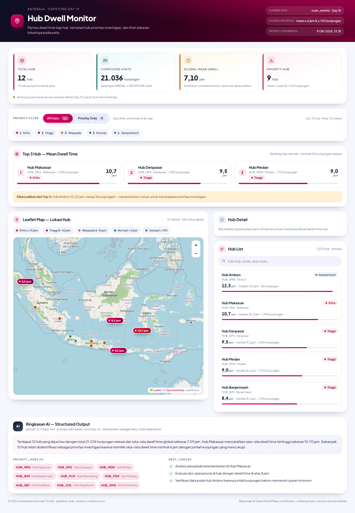

# Anteraja Hub Dwell Monitor (Day 19)

Aplikasi operasional untuk supervisor hub: memantau **dwell time** tiap hub, menemukan hub yang
perlu diinvestigasi, melihat sebaran lokasinya di peta, dan membaca ringkasan AI yang terstruktur.

Dibangun dengan **React + Vite + Leaflet**, memakai data metrics dan locations dari proses
sebelumnya (Day 18 - Big Data Bottleneck Hubs) serta desain **Stitch** sebagai acuan visual.

| Ringkasan data | Nilai |
| --- | --- |
| Hub | 12 (semuanya punya koordinat) |
| Completed visits | 21.036 pasangan ARRIVAL → DEPARTURE valid |
| Global mean dwell time | 7,10 jam (berbobot completed visits) |
| Hub prioritas | 9 (mean ≥ 6 jam dan ≥ 100 kunjungan) |
| Top 3 | Hub Makassar 10,70 jam · Hub Denpasar 9,48 jam · Hub Medan 8,96 jam |



## Menjalankan aplikasi

```bash
npm install          # sekali saja
npm run dev          # http://localhost:5173
npm run test         # 42 unit test (logika metrics, kontrak AI, klien Gemini)
npm run build        # build produksi ke dist/
```

Perintah pendukung:

| Perintah | Fungsi |
| --- | --- |
| `npm run data:build` | Menurunkan `public/data/metrics.json` dari `scripts/data/scan_events.csv` |
| `npm run ai:test` | Menjalankan 4 skenario uji ringkasan AI + validasi kontrak JSON |
| `npm run shots` | Mengambil screenshot desktop 1440, mobile 390, application state, dan mockup desain |

> `npm run shots` memakai Playwright dan mengharapkan dev server (`npm run dev`) sudah berjalan di
> `http://localhost:5173` (bisa diubah lewat `BASE_URL`).

### Menghubungkan Google AI Studio (opsional)

Uji ringkasan AI bisa dijalankan ke model Gemini sungguhan:

```bash
cp .env.example .env        # lalu isi GEMINI_API_KEY dari https://aistudio.google.com/apikey
npm run ai:test -- --provider=gemini
# atau tanpa .env:
GEMINI_API_KEY=... npm run ai:test -- --provider=gemini
# atau lewat flag:
npm run ai:test -- --provider=gemini --api-key=... --model=gemini-2.5-flash
```

Kunci dibaca dari flag `--api-key`, environment variable (`GEMINI_API_KEY`, `GOOGLE_API_KEY`,
`AI_STUDIO_API_KEY`), atau `.env`; kunci dikirim lewat header `x-goog-api-key` dan tidak pernah
masuk ke berkas bukti. Tanpa kunci, perintah tetap jalan memakai provider `mock` yang offline.

## Struktur

```
hub-dwell-monitor/
├── public/
│   ├── data/            metrics.json · locations.json · ai-summary.json
│   └── fonts/           Plus Jakarta Sans (offline)
├── src/
│   ├── components/      KPI, Top 3, filter, map, list, detail, AI panel, status
│   ├── hooks/           useHubData (loading · ready · empty · error)
│   ├── lib/             metrics.js (ranking, filter, severity) · mapIcons.js
│   ├── App.jsx
│   └── main.jsx
├── scripts/
│   ├── lib/             dwell-metrics.mjs · summary-contract.mjs
│   ├── data/            scan_events.csv (dataset Day 18, untuk reproduksi)
│   ├── derive-data.mjs  scan_events.csv → metrics.json
│   ├── run-ai-scenarios.mjs  4 skenario ringkasan AI + validator
│   ├── ai-summary-prompt.md  prompt sumber untuk AI Studio
│   ├── ai-scenarios/    bukti output 4 skenario
│   └── screenshots.mjs  Playwright screenshots
├── tests/               metrics.test.mjs · summary-contract.test.mjs
├── design/              mockup HTML v1/v2 + design system Stitch
├── docs/                hub-dwell-monitor.md (dokumentasi lengkap)
└── screenshots/         stitch v1/v2 · mockup · desktop · mobile · application states
```

## Sumber data

1. `scripts/data/scan_events.csv` - dataset scan event Day 18 (45.542 baris, 12 hub, seed tetap).
2. `npm run data:build` membersihkan data (timestamp rusak, duplikat, pasangan tidak lengkap) dan
   menulis `public/data/metrics.json` berisi KPI global + metrik per hub
   (mean, median, min, max, p90, completed visits, status prioritas).
3. `public/data/locations.json` menambahkan koordinat pusat kota tiap hub (data latihan, bukan
   alamat hub produksi).
4. `public/data/ai-summary.json` adalah keluaran terstruktur (summary, priority_hubs, next_checks)
   dari runner skenario uji.

Aplikasi hanya membaca file JSON statis dari `public/data`; seluruh teks dari AI ditampilkan
sebagai teks, tidak pernah dieksekusi.

## Catatan penting

- Ambang **6 jam** (dan tingkat keparahan Kritis/Tinggi/Waspada) adalah **aturan simulasi latihan
  Day 19**, bukan SLA resmi Anteraja.
- `HUB_AMB` punya mean tertinggi (12,32 jam) tetapi hanya 36 kunjungan selesai sehingga
  dikecualikan dari Top 3 dan daftar prioritas; alasannya ditulis eksplisit di UI dan dokumentasi.
- Desain mengacu pada hasil Stitch (lihat `docs/hub-dwell-monitor.md` bagian 3).
